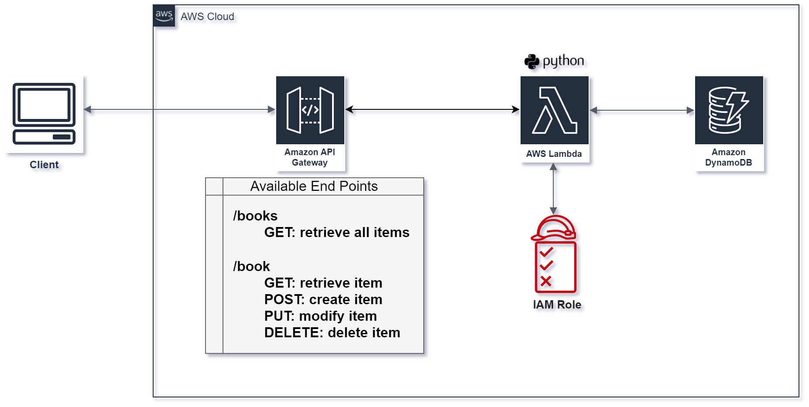

# serverless-api-lambda
 AWS Services used: Lambda functions API Gateway and DynamoDB

## Diagram

## Terraform was used to 
- Instanciate a DynamoDB instance and with a table "Books" 
- Configure IAM Role for lambda function
- Configure IAM Role Policy to provide access to DynamoDB and CloudWatch Logs
- Create a Log group for CloudWatch
- Create an API gateway to provide triggers for Lambda Function
- Create two resources
    Books (/books)
        GET method: get all books 
    Book (/book)
        GET method: get a book with query parameter book_id
        POST method: add a book to the database
        PUT method: modify attributes of an existing item in database
        DELETE method: delete book from database

## Code
### lambda_function.py
    - The lambda_handler(event, context) is defined in this file.

### methods.py
    - This file contains the functionalities of the API methods.
    - Boto3 was used to access DynamoDB (read, write and delete operations)